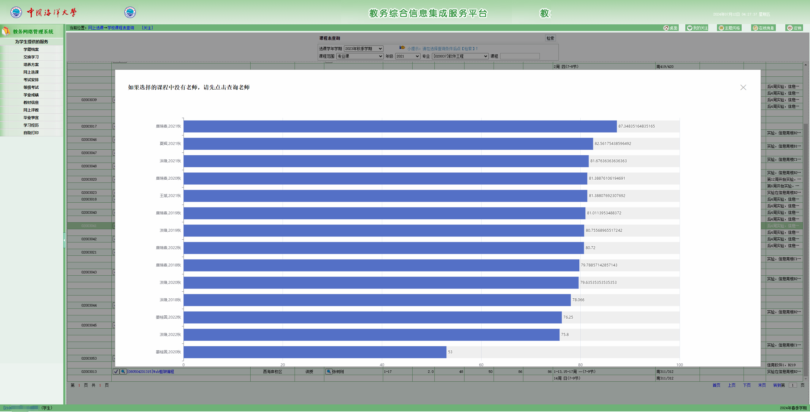
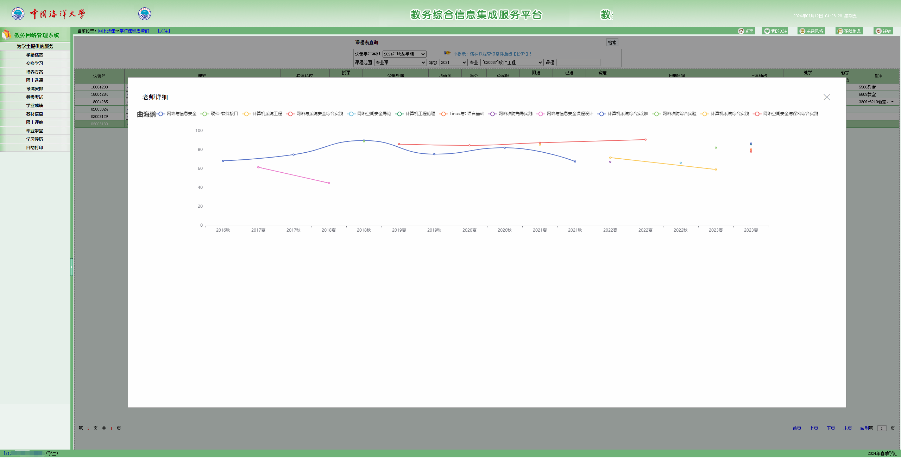
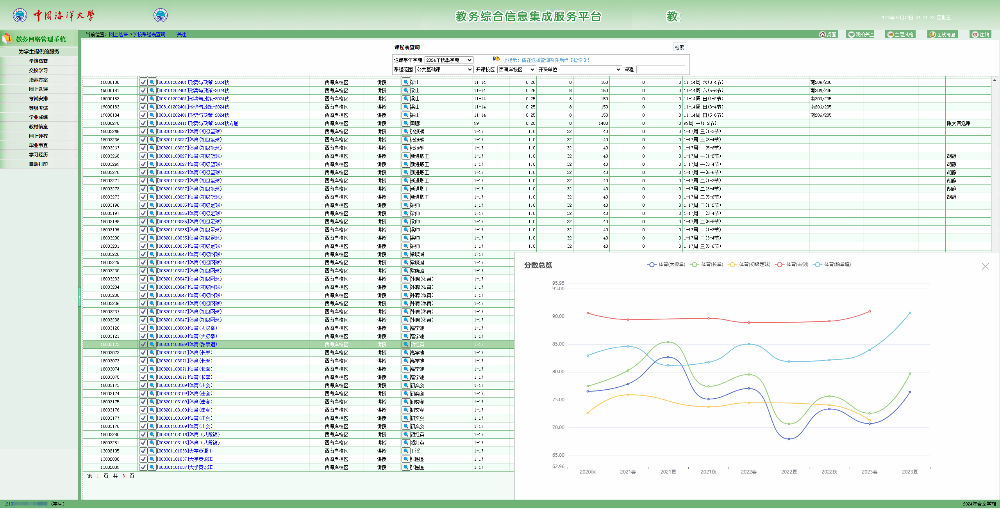

# OUC选课助手

OUC选课助手是一个Chrome浏览器扩展，旨在帮助中国海洋大学（OUC）的学生更好地进行选课决策。

## 功能特点

- 快速查看同一课程不同教师的历史给分情况(结合教师和学期信息，以降序方式展示课程均分)

  

- 显示教师历史给分情况

  

- 多门课程之间的对比功能

  

## 安装方法

1. 下载本仓库的ZIP文件或克隆到本地
2. 打开Chrome浏览器，进入扩展管理页面（chrome://extensions/）
3. 开启右上角的"开发者模式"
4. 点击"加载已解压的扩展程序"，选择本仓库所在文件夹

## 使用说明

数据来源于WeOUC，做了可视化处理，让数据展现更直观。

## 贡献指南

我们欢迎所有形式的贡献，包括但不限于：

- 报告Bug
- 提出新功能建议
- 改进代码
- 完善文档

请提交issue或pull request来参与项目改进。

还有很多功能可以添加，欢迎学弟学妹们提出意见和增加功能。

## 免责声明

本扩展仅供学习交流使用，请勿用于任何非法用途。使用本扩展所产生的一切后果由用户自行承担。

## 许可证

本项目采用 [MIT 许可证](LICENSE)。

## 联系方式

如有任何问题或建议，请通过以下方式联系我们：

- 提交GitHub Issue
- 发送邮件至：[admin@itstudio.club](mailto:admin@itstudio.club)

感谢您对OUC选课助手的支持！